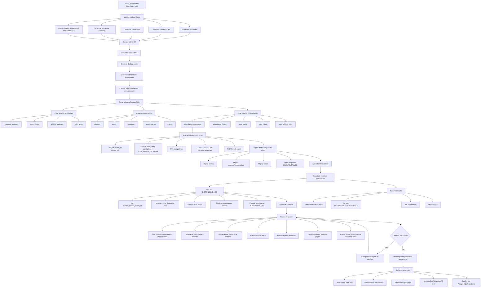
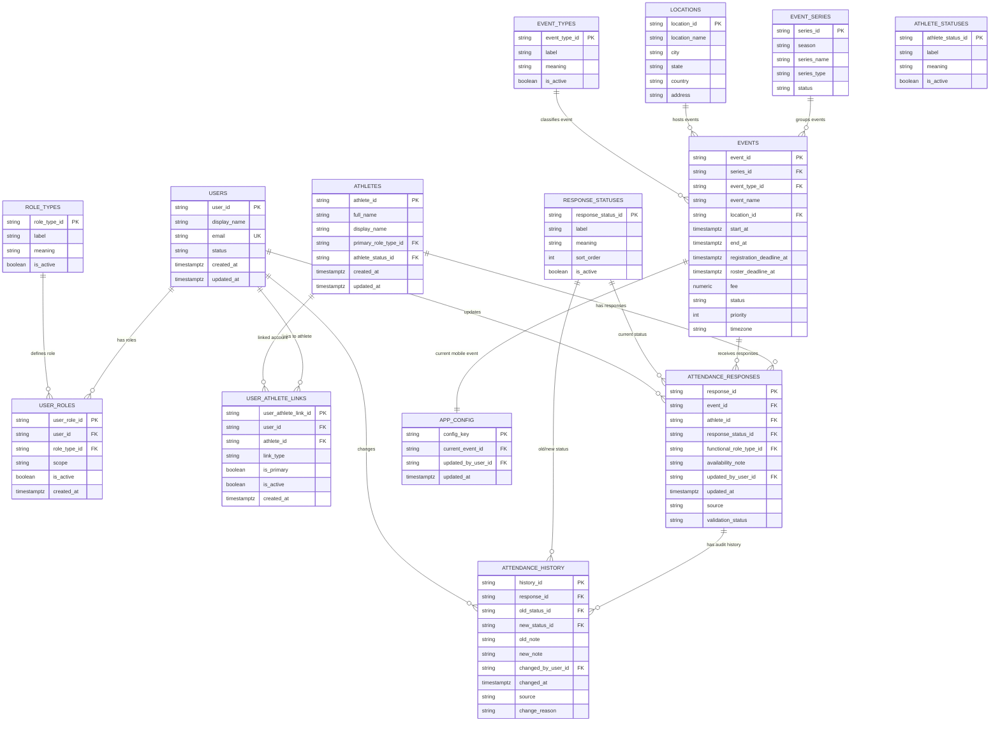

# **Modelagem dos Dados**

A modelagem foi pensada no primeiro momento com foco em attendance. Nesse primeiro momento foi
pensada apenas em relação a planilha . Foram feitas algumas pesquisas rápidas sobre modelagem de
dados, testes de modelagem e implementação.

**Existe uma necessidade de revisão para avaliar o impacto sofrido na modelagem por outras áreas do projeto e a necessidade de redefinir conceitos.**

## 1. Governança e Processos

## 1.1 Planos - Status

Indicam o estágio de estruturação ou implementação das ações planejadas.

* **Rascunho (Draft):** Em fase de concepção e brainstorming.

* **Em Planejamento:** O escopo está sendo definido e detalhado.

* **Aprovado:** Validado pelos responsáveis e pronto para execução.

* **Em Execução:** As ações do plano estão sendo aplicadas na prática.

* **Concluído:** Todas as etapas finalizadas com sucesso.

* **Suspenso / Cancelado:** Interrompido temporariamente ou descartado.

## 1.2 Glossário

Explicam os termos utilizados no texto desse plano

* **CEPRAEA:** Equipe brasileira de alto rendimento do handebol de areia adulto feminino

* **ScoutPraia:** Módulo de scout para jogos de handebol de areia.

## Fundamentos de Modelagem

## **Visão Geral das Metodologias**

A modelagem de dados é a base de qualquer arquitetura robusta. Existem três abordagens principais,
cada uma com suas forças específicas para o negócio:

### **Kimball — Data Marts para Áreas de Negócio**

Foca na criação de subconjuntos de dados (data marts) para atender necessidades rápidas e
específicas de departamentos, facilitando a análise direta pelo usuário final.

### **Inmon — Abordagem Centralizada**

Constrói um grande armazém de dados centralizado (Data Warehouse), garantindo uma versão única da
verdade e consistência em toda a organização.

### **Data Vault — Agilidade e Escalabilidade**

Projetado para ser modular e escalável, permitindo integrar novas fontes de dados rapidamente sem
reconstruir o modelo existente.

## 3. `Projeto SCOUT_BEACHHANDBALL`: Modelagem Técnica

O foco atual está na consolidação da versão v0.3 "hardening" para garantir que o banco seja
confiável para produção.

Correções necessárias:

1. **app_config singleton**

   * config_key fixo: CFG_MOBILE_SESSION

   * constraint:
     CHECK (config_key = 'CFG_MOBILE_SESSION')

   * impede múltiplas configs paralelas.

2. **Histórico registra nota**

   * adicionar:
     old_note
     new_note

   * ou change_payload_json

   * Para este caso, melhor começar com old_note/new_note.

3. **Tempo padronizado**

   * todos os campos temporais operacionais devem virar TIMESTAMPTZ

   * exemplos:
     start_at
     end_at
     registration_deadline_at
     roster_deadline_at
     updated_at
     changed_at

4. **RBAC multi-papel**

   * remover user_role_type_id direto de users;

   * criar tabela:
     user_roles

   * campos:
     user_id
     role_type_id
     scope
     is_active

5. **Usuário x atleta**

   * manter users.athlete_id opcional apenas como vínculo primário;

   * quando precisar múltiplos vínculos, criar:
     user_athlete_links.

Veredito: **v0.3 deve endurecer concorrência, auditoria, tempo e permissões**. Depois disso, a
modelagem fica muito mais próxima de um banco realmente confiável.

Posso ajudar com o DBDiagram, mas não consigo interagir diretamente com a interface do site apenas
com a URL.

O DBDiagram é a ferramenta oficial:

Se o objetivo é modelar o banco do Attendance Projeto SCOUT_BEACHHANDBALL, a próxima etapa recomendada é converter a
modelagem v0.3 para a linguagem **DBML (Database Markup Language)** do DBDiagram.

Com isso você consegue:

* visualizar o diagrama ER completo;

* validar cardinalidades;

* identificar ciclos;

* verificar dependências;

* exportar para PostgreSQL;

* compartilhar o modelo com outros analistas.

A estrutura v0.3 já possui entidades suficientes para gerar um primeiro ERD:

* athletes

* users

* user_roles

* user_athlete_links

* locations

* event_series

* events

* attendance_responses

* attendance_history

* response_statuses

* event_types

* athlete_statuses

* role_types

* app_config

A próxima ação mais útil é eu gerar o **DBML completo da v0.3**, pronto para você colar no editor
do DBDiagram e visualizar imediatamente o banco.

Se quiser seguir, eu monto a versão DBML completa com:

* tabelas;

* PKs;

* FKs;

* UNIQUEs;

* constraints documentadas;

* observações arquiteturais da v0.3.

**plano em Mermaid** para transformar a modelagem attendance v0.3 em banco real



E o **ER lógico simplificado** em Mermaid:



## 4. Análise de Ciência de Dados

O artigo apresenta a Ciência de Dados como um processo para transformar dados brutos em informações
úteis à tomada de decisão empresarial. Embora a página da Neurotech tenha bloqueado o acesso
automatizado direto, o conteúdo integral está disponível em uma publicação do mesmo autor, Danilo
Torres, com o mesmo título e texto. A página também aparece indexada no site da Neurotech.

## **1. O que é Data Science**

Segundo o artigo, Ciência de Dados não é uma área totalmente nova. Ela ganhou maior relevância por
causa de três avanços:

* popularização do Big Data;

* amadurecimento do Machine Learning;

* aumento da capacidade de processamento dos computadores.

Sua finalidade é analisar qualquer quantidade de dados — grande ou pequena — e convertê-la em
insights que ajudem empresas a tomar decisões estratégicas e alcançar melhores resultados.

Isso é realizado principalmente por métodos estatísticos e algoritmos que procuram padrões nos
dados. Esses padrões podem ser utilizados para:

* descrever o que ocorreu;

* explicar determinados comportamentos;

* estimar o que poderá acontecer no futuro.

O artigo concentra-se principalmente na terceira utilização: a criação de modelos preditivos.

## **2. O que é um modelo preditivo**

O texto define modelo preditivo, de maneira simplificada, como uma função matemática aplicada a uma
massa de dados para identificar regras ocultas e prever resultados futuros.

A lógica apresentada é:

Dados históricos
↓
Identificação de relações e padrões
↓
Treinamento do modelo
↓
Aplicação em casos novos
↓
Previsão ou classificação

Portanto, o modelo aprende com acontecimentos registrados anteriormente e utiliza o aprendizado
para avaliar situações ainda desconhecidas.

## **3. Exemplo da análise de crédito**

O artigo usa a concessão de crédito por bancos e financeiras como exemplo central.

Uma instituição possui dados históricos de clientes que solicitaram empréstimos. Entre as
informações disponíveis podem estar:

* características pessoais e financeiras;

* comportamento anterior;

* atributos relacionados à solicitação;

* resultado final: pagamento ou inadimplência.

Esses dados são utilizados para identificar padrões associados a bons e maus pagadores. Depois de
treinado, o modelo analisa uma pessoa que não estava na base inicial e calcula uma pontuação, ou
*score*.

No exemplo hipotético apresentado, um novo cliente recebe score 92 em uma escala de 0 a 100. Essa
pontuação representa uma probabilidade muito elevada de ele ser um bom pagador. O banco pode usar
essa estimativa para decidir se concede ou não o empréstimo.

O artigo não afirma que o modelo toma necessariamente a decisão sozinho. Ele funciona como
instrumento para tornar a decisão empresarial mais informada e precisa.

## 4. Aprendizado supervisionado

O texto menciona modelos supervisionados e não supervisionados, mas desenvolve apenas o aprendizado
supervisionado.

No modelo supervisionado, a base de treinamento contém:

* as variáveis ou características de cada caso;

* a resposta conhecida, denominada variável-alvo.

No exemplo de crédito:

* as características dos clientes são as variáveis de entrada;

* “bom pagador” ou “inadimplente” é a variável-alvo.

Como o resultado histórico já está identificado, diz-se que a base está rotulada. O algoritmo
procura correlações entre as características dos clientes e o resultado conhecido.

Depois do treinamento, ele aplica os padrões aprendidos a clientes novos, cujo comportamento futuro
ainda não é conhecido.

O artigo observa que problemas empresariais dessa natureza podem utilizar bases com centenas de
milhares ou milhões de registros.

## **5. O processo CRISP-DM**

A principal mensagem prática do artigo é que Ciência de Dados não se resume a escolher um algoritmo
ou treinar um modelo.

A Neurotech afirma utilizar o CRISP-DM — *Cross-Industry Standard Process for Data Mining* — como
estrutura para resolver problemas empresariais com dados. O processo contém seis fases.

### **1. Entendimento do problema de negócio**

Antes de analisar dados, é necessário compreender:

* qual problema precisa ser resolvido;

* quais objetivos a empresa pretende alcançar;

* quais decisões precisam ser tomadas;

* quais informações seriam necessárias para fundamentá-las.

Essa fase define o propósito do projeto. Sem ela, um modelo pode ser tecnicamente sofisticado e,
mesmo assim, não resolver nenhuma necessidade real.

### **2. Entendimento dos dados**

Depois de compreender o problema, avaliam-se os dados disponíveis:

* quais dados existem;

* de onde vieram;

* como se comportam;

* quais problemas de qualidade apresentam;

* se realmente ajudam a explicar o fenômeno estudado.

O simples fato de possuir muitos dados não significa que eles sejam adequados para responder à
pergunta empresarial.

### **3. Preparação dos dados**

Nesta fase é construído o conjunto final que será utilizado na modelagem.

O artigo menciona atividades como:

* coleta;

* limpeza;

* formatação;

* combinação de diferentes fontes;

* amostragem.

Essa preparação busca deixar os dados consistentes e utilizáveis pelos algoritmos.

### **4. Modelagem**

São escolhidas e aplicadas as técnicas de modelagem. Também são ajustados os parâmetros do modelo.

As perguntas principais são:

* qual algoritmo é mais adequado;

* quais variáveis parecem mais relevantes;

* quais configurações produzem os melhores resultados.

O processo não é estritamente linear. Se a modelagem revelar um problema na base, pode ser
necessário retornar à preparação dos dados e refazer etapas anteriores.

### **5. Validação**

Um bom desempenho estatístico não é suficiente. O modelo precisa ser confrontado com os objetivos
empresariais.

O artigo propõe verificar:

* se o resultado é satisfatório;

* se o modelo consegue diferenciar adequadamente os grupos;

* se responde às perguntas do negócio;

* se pode realmente apoiar as decisões pretendidas.

Caso o resultado não seja adequado, as etapas anteriores devem ser repetidas quantas vezes forem
necessárias.

### **6. Implantação**

O modelo treinado é colocado em funcionamento com dados reais e casos que ele ainda não conhece.

Somente nesse momento é possível avaliar se ele:

* funciona fora da base de treinamento;

* mantém o desempenho esperado;

* diferencia corretamente os casos;

* ajuda o time de negócios a decidir melhor.

O artigo considera a implantação indispensável porque um modelo que funciona apenas em
experimentos, mas nunca é utilizado em situações reais, não produz valor para a empresa.

## **6. Um modelo perfeito pode indicar problema**

O texto alerta que nenhum modelo realista acerta 100% dos casos.

Se isso acontecer, pode existir algum erro nos dados ou *overfitting* — sobreajuste. Nesse
fenômeno, o modelo memoriza excessivamente os dados de treinamento, apresentando desempenho
aparentemente perfeito nessa base, mas falhando quando recebe casos novos.

Por outro lado, um modelo com bom desempenho que nunca chega à produção também não possui valor
empresarial concreto.

A posição central do autor é: o melhor modelo não é necessariamente o que apresenta a maior métrica
em laboratório, mas aquele que funciona em produção e auxilia decisões reais.

## **7. Como comprovar o valor para o negócio**

Depois da implantação, o modelo deve ser avaliado pelo impacto que produz. O artigo menciona a
realização de uma análise de impacto financeiro.

Isso significa que não basta perguntar “o algoritmo acertou?”. Também é necessário verificar:

* as decisões melhoraram;

* as perdas diminuíram;

* o risco foi reduzido;

* a empresa passou a aprovar melhores clientes;

* o benefício obtido justifica o custo da solução.

O artigo apenas menciona essa análise, sem explicar sua metodologia, deixando-a como assunto para
outra publicação.

## **Conclusão do artigo**

A mensagem essencial é esta:

Ciência de Dados não começa pelo algoritmo e não termina quando o modelo é treinado.

Ela começa pela compreensão de um problema real, passa pelo entendimento e preparação dos dados,
utiliza modelagem e validação e somente produz valor quando a solução é implantada e testada na
realidade da organização.

Em termos simples:

Problema empresarial
→ dados adequados
→ preparação
→ modelo
→ validação
→ uso real
→ impacto mensurável

Portanto, para o autor, Data Science ajuda um negócio quando transforma dados históricos em
previsões úteis, incorpora essas previsões ao processo decisório e comprova que elas geram
resultados concretos.

O conhecimento do artigo muda a interpretação da modelagem do Projeto SCOUT_BEACHHANDBALL: ela não deve apenas
armazenar dados corretamente; precisa produzir dados capazes de responder a uma decisão real.

A modelagem atual está adequada como banco operacional de disponibilidade, mas ainda não constitui
uma base analítica ou preditiva completa. O artigo reforça que criar tabelas e relacionamentos
corresponde apenas à preparação dos dados — uma parte do processo CRISP-DM.

## **Impacto principal**

Hoje, a modelagem responde:

“O que cada atleta declarou sobre sua disponibilidade para determinado evento?”

Para aplicar Ciência de Dados, ela precisaria também responder:

“O que realmente aconteceu, quais fatores influenciaram o resultado, qual decisão foi tomada e essa
decisão produziu qual efeito?”

Essa diferença é fundamental.

## **5. Roadmap e Evolução**

## **1. A modelagem atual registra intenção, não resultado real**

Na aba 05_ATTENDANCE_RESPONSES, cada registro contém:

* atleta;

* evento;

* resposta SIM, NÃO, TALVEZ ou PENDENTE;

* função prevista;

* observação;

* autor e momento da alteração;

* origem e estado de validação.

Isso registra a declaração da atleta. Porém, uma resposta SIM não prova que ela:

* compareceu;

* participou;

* chegou no horário;

* permaneceu disponível;

* foi convocada;

* efetivamente jogou ou treinou.

Para análise preditiva, é necessário separar:

Declaração anterior ao evento ≠ resultado observado no evento

Sem essa separação, o sistema não possui uma variável-alvo confiável.

### **Mudança necessária**

Criar uma entidade distinta, por exemplo:

event_participation

* participation_id

* event_id

* athlete_id

* attendance_outcome_id

* arrived_at

* departed_at

* participated

* participation_role_type_id

* absence_reason_id

* recorded_by_user_id

* recorded_at

* validation_status

Com estados como:

* ATTENDED;

* ABSENT;

* LATE;

* EXCUSED;

* NOT_SELECTED;

* DID_NOT_PARTICIPATE.

Assim:

* attendance_responses continua representando a intenção;

* event_participation representa o fato ocorrido.

Essa é a alteração estrutural mais importante provocada pelo conhecimento do artigo.

## **2. É necessário definir primeiro qual decisão será apoiada**

O CRISP-DM começa pelo entendimento do problema de negócio. Na modelagem atual, o objetivo
operacional está claro: registrar disponibilidade. Mas o objetivo analítico ainda não está
formalizado.

Possíveis problemas do CEPRAEA seriam:

* prever quantas atletas estarão realmente disponíveis;

* identificar risco de desfalque por função;

* estimar probabilidade de uma atleta alterar sua resposta;

* detectar atletas que frequentemente confirmam e não comparecem;

* antecipar insuficiência de goleiras, defensoras ou atletas de ataque;

* decidir quando convocar substitutas;

* medir se prazos e lembretes reduzem respostas pendentes;

* avaliar a estabilidade do elenco ao longo da temporada.

Cada pergunta exige dados e variáveis diferentes. Portanto, o esquema não deve ser ampliado
genericamente para “fazer IA”. Primeiro deve existir um caso de uso declarado.

Uma estrutura possível seria:

analytics_use_cases

* use_case_id

* business_question

* decision_supported

* target_definition

* prediction_horizon

* success_metric

* responsible_user_id

* status

## **3. Disponibilidade funcional precisa ser temporal**

A modelagem atual possui functional_role_type_id na resposta. Isso é positivo porque registra a
função prevista para aquele evento, em vez de depender somente da função principal da atleta.

Mas, para futuras análises, deve permanecer claro que:

athletes.primary_role_type_id

representa uma característica relativamente estável da atleta, enquanto:

attendance_responses.functional_role_type_id

representa o contexto funcional planejado para determinado evento.

A função realmente desempenhada deverá ficar em event_participation ou em uma entidade de
escala/convocação. Não se deve sobrescrever a função planejada com o que aconteceu posteriormente.

Isso preserva três fatos diferentes:

1. função principal;

2. função prevista;

3. função efetivamente exercida.

## **4. O histórico atual é uma base analítica valiosa**

A aba 06_ATTENDANCE_HISTORY registra:

* estado anterior e novo;

* observação anterior e nova;

* pessoa que alterou;

* momento da mudança;

* origem;

* motivo da alteração.

Isso está muito alinhado ao artigo, porque permite estudar comportamento ao longo do tempo, em vez
de conservar apenas o valor final.

Ela possibilita calcular:

* tempo até a primeira resposta;

* quantidade de alterações por atleta;

* frequência de TALVEZ → SIM;

* frequência de SIM → NÃO;

* respostas alteradas depois do prazo;

* estabilidade da disponibilidade;

* influência de lembretes ou proximidade do evento.

Portanto, attendance_history não deve ser removida nem substituída. Ela é uma das partes mais
importantes da futura camada analítica.

## **5. É preciso impedir vazamento temporal**

Se futuramente o CEPRAEA quiser prever a disponibilidade de uma atleta, o modelo só poderá utilizar
informações existentes no momento da previsão.

Exemplo incorreto:

Prever em 1º de julho se a atleta irá ao evento
usando a resposta alterada em 5 de julho.

O banco já possui changed_at e updated_at, o que permite evitar esse erro. Entretanto, a futura
camada analítica deverá registrar explicitamente o momento de corte:

feature_snapshots

* snapshot_id

* athlete_id

* event_id

* as_of_at

* feature_definition_version

* generated_at

O campo as_of_at significa:

“Estas eram as informações conhecidas até este momento.”

Sem esse controle, um modelo pode aparentar ótimo desempenho por utilizar informações do futuro.

## **6. A qualidade temporal apresenta uma inconsistência concreta**

A modelagem declara corretamente que campos operacionais devem usar TIMESTAMPTZ, e os eventos
incluem America/Sao_Paulo.

Entretanto, encontrei dois pontos para correção:

* a planilha está configurada com fuso Etc/GMT;

* o exemplo de updated_at em 05_ATTENDANCE_RESPONSES está como 2026-06-19T00:00:00, sem deslocamento -03:00.

Já o histórico utiliza 2026-06-19T00:00:00-03:00.

Isso cria risco de:

* classificar resposta como atrasada ou pontual incorretamente;

* ordenar alterações no momento errado;

* calcular tempo de resposta com diferença de três horas;

* contaminar variáveis utilizadas em futuras análises.

Antes de qualquer análise, todos os horários devem ter uma representação temporal inequívoca.

## **7. Testes estruturais não bastam para Ciência de Dados**

Os testes atuais verificam corretamente:

* unicidade;

* integridade referencial;

* auditoria;

* fuso horário;

* permissões;

* migração;

* funcionamento das visões.

Esses são testes do banco e da aplicação. Devem permanecer.

Mas uma camada analítica exigiria outros tipos de teste:

### **Qualidade dos dados**

* percentual de atletas sem resultado final;

* eventos sem encerramento;

* respostas posteriores ao evento;

* resultado real incompatível com a situação do evento;

* duplicidade de participação;

* ausência de papel funcional;

* inconsistência entre confirmação e comparecimento.

### **Validação analítica**

* definição inequívoca da variável-alvo;

* separação entre treino e teste;

* prevenção de vazamento temporal;

* desempenho mínimo por categoria funcional;

* comparação com uma regra simples;

* avaliação com dados nunca vistos.

### **Validação de negócio**

* a previsão modifica alguma decisão;

* a decisão ocorre com antecedência suficiente;

* o treinador compreende o resultado;

* falsos alertas não geram convocações desnecessárias;

* o sistema reduz desfalques ou trabalho manual.

O artigo enfatiza justamente que um modelo tecnicamente bom não possui valor se não apoiar uma
decisão real.

## **8. Predições não devem ser misturadas com fatos**

Resultados produzidos por algoritmos não devem ser gravados em attendance_responses nem em
event_participation.

É necessário conservar a distinção:

Fato humano:
atleta respondeu TALVEZ

Fato observado:
atleta compareceu

Inferência:
modelo estimou 72% de probabilidade de comparecimento

Uma futura camada preditiva poderia conter:

predictive_models

* model_id

* use_case_id

* model_version

* training_data_cutoff

* target_definition

* status

prediction_runs

* prediction_run_id

* model_id

* generated_at

* as_of_at

attendance_predictions

* prediction_id

* prediction_run_id

* athlete_id

* event_id

* predicted_probability

* predicted_class

Isso impede que uma previsão seja tratada como verdade do domínio.

## **9. Também é necessário registrar a decisão humana**

Se o objetivo é ajudar o treinador, não basta armazenar a previsão. É preciso registrar o que foi
decidido com base nela.

Exemplo:

decision_records

* decision_id

* event_id

* prediction_run_id

* decision_type_id

* decision_value

* decided_by_user_id

* decided_at

* justification

Decisões possíveis:

* convocar substituta;

* enviar lembrete;

* mudar função;

* reduzir elenco;

* confirmar transporte;

* cancelar participação;

* manter planejamento original.

Depois, o resultado real pode ser comparado com a decisão tomada.

## **10. É necessário medir impacto, não apenas acurácia**

Para o CEPRAEA, impacto não precisa ser exclusivamente financeiro. Pode ser operacional ou
esportivo:

* redução de respostas pendentes;

* redução de confirmações não cumpridas;

* menor número de eventos com falta de atleta por função;

* menor tempo gasto pelo treinador cobrando respostas;

* maior antecedência na definição do elenco;

* menor custo de inscrições, hospedagem ou passagens desperdiçadas;

* maior estabilidade da composição competitiva.

Essas métricas devem ser definidas antes de construir qualquer modelo.

## **Veredito sobre a modelagem atual**

Ela está bem estruturada como:

* banco transacional;

* registro de disponibilidade;

* histórico auditável;

* controle de identidade e permissões;

* futura fonte confiável de dados brutos.

Porém, ela ainda não permite concluir:

* se a atleta efetivamente participou;

* se a declaração estava correta;

* quais fatores explicaram o resultado;

* qual decisão foi apoiada;

* se a decisão melhorou o trabalho do CEPRAEA.

A arquitetura correta passa a ser:

CAMADA OPERACIONAL
Atletas + eventos + respostas + histórico
↓
CAMADA DE VERDADE OBSERVADA
Convocação + comparecimento + participação real
↓
CAMADA ANALÍTICA
Variáveis derivadas + cortes temporais + métricas
↓
CAMADA PREDITIVA
Modelos + versões + previsões
↓
CAMADA DECISÓRIA
Decisão humana + resultado + impacto

Conclusão: o artigo não demonstra que você deve começar agora um modelo de Machine Learning. Ele
demonstra que a modelagem atual precisa preservar dados históricos e resultados reais para que,
futuramente, a Ciência de Dados seja possível. A próxima alteração prioritária é modelar o
comparecimento e a participação efetivos, separados da disponibilidade declarada.

## **25_BUSINESS_OUTCOMES: Definição de Resultados**

Esta seção formaliza os objetivos de negócio que guiam a modelagem técnica, garantindo que os dados
coletados suportem decisões reais.

Neste momento, a “saída esperada” está sendo escrita em **vários lugares diferentes da modelagem**,
cada um com um propósito distinto.

Se analisarmos pela ótica de Ciência de Dados e Engenharia de Dados, isso é exatamente o próximo
ponto que precisa ser formalizado.

### **Hoje ela aparece implicitamente em:**

#### **1.**

#### **22_ACCEPTANCE_TESTS**

Aqui a saída esperada está escrita como critério de aceite técnico.

Exemplo:

ATD-001
expected_result:
Banco rejeita segunda inserção por uq_attendance_event_athlete

Isso é uma saída esperada de sistema.

---

#### **2.**

#### **24_DEPLOY_PLAN**

Aqui a saída esperada está escrita como resultado de cada fase.

Exemplo:

Fase:
migration

Output:
Dados normalizados

Acceptance Gate:
Cada célula antiga tem response_id
ou está marcada como pendente

Isso é uma saída esperada de implantação.

---

#### **3.**

#### **23_CRITICAL_QUERIES**

Aqui a saída esperada está implícita na query.

Exemplo:

attendance_screen

A expectativa é:

retornar todas as atletas ativas

* resposta atual
* evento ativo

Mas isso não está documentado explicitamente.

---

#### **4.**

#### **05_ATTENDANCE_RESPONSES**

Aqui existe a saída operacional real.

Exemplo:

Evento:
Matinhos

Atleta:
Aline Augusto

Resposta:
SIM

Essa é a saída observada do processo.

---

### **O problema**

O artigo de Data Science mostrou exatamente uma lacuna que ainda existe na modelagem.

Hoje temos:

Entrada
↓
Processamento
↓
Saída observada

Mas não temos uma entidade formal chamada:

EXPECTED_OUTCOME

ou

TARGET_VARIABLE

que responda:

“O que significa sucesso?”

---

### **Exemplo prático no CEPRAEA**

Se a pergunta for:

Quem vai para Matinhos?

A saída esperada NÃO é:

SIM

A saída esperada é:

Participou efetivamente

Ou seja:

## Resposta declarada ≠ Resultado observado

### **Onde ela deveria ficar**

Eu criaria uma nova aba:

25_BUSINESS_OUTCOMES

com estrutura parecida com:

| outcome_id | business_question | expected_outcome | measured_by |
| :---- | :---- | :---- | :---- |
| OUT_001 | Quem vai para o evento? | Atleta compareceu | event_participation |
| OUT_002 | Quem responde com antecedência? | Resposta antes do prazo | attendance_responses |
| OUT_003 | Quem muda frequentemente de resposta? | ≤ 1 alteração por evento | attendance_history |
| OUT_004 | Existe elenco suficiente? | Todas as funções cobertas | roster_analysis |

---

### **Para o Attendance CEPRAEA**

A saída esperada principal hoje deveria ser formalizada como:

BUSINESS QUESTION
5_BUSINESS_OUTCOMES é a ponte entre o seu modelo técnico (tabelas, chaves, constraints) e o sucesso
do CEPRAEA (decisões, economia, planejamento).

Esta estrutura que desenhei abaixo é pensada para que qualquer gestor do projeto, ao ler a aba,
entenda **por que** aquele dado está sendo coletado e **qual decisão** ele apoia.

Aqui está o rascunho para a sua nova aba:

---

**25_BUSINESS_OUTCOMES (Sugestão de Estrutura)**

| ID | Pergunta de Negócio | Saída Esperada (Sucesso) | Medido por (Fonte) | Decisão Suportada |
| :---- | :---- | :---- | :---- | :---- |
| **OUT_001** | Quem efetivamente comparecerá ao evento? | Atleta compareceu conforme planejado | event_participation.participated | Convocação, Inscrição, Transporte, Hospedagem |
| **OUT_002** | O elenco é suficiente para o evento? | Todas as funções técnicas cobertas | attendance_responses.functional_role_type_id | Convocar substitutas, ajustar planejamento |
| **OUT_003** | A atleta responde com antecedência? | Resposta coletada antes do prazo (registration_deadline) | attendance_responses.updated_at vs events.registration_deadline_at | Envio de lembretes, cobrança de gestão |
| **OUT_004** | O comportamento da atleta é estável? | ≤ 1 alteração de status por evento | attendance_history.response_id | Seleção de elenco principal, renovação |
| **OUT_005** | Qual a taxa de "falso positivo"? | (Confirmação SIM) == (Comparecimento REAL) | attendance_responses vs event_participation | Ajuste de estratégia de cobrança de presença |

---

**Como interpretar e usar esta tabela:**

* **ID:** Um identificador único que facilitará referenciar o objetivo em relatórios ou dashboards futuros.

* **Pergunta de Negócio:** É a dor ou a dúvida que o treinador ou gestor tem no dia a dia. Escreva de forma simples, como se estivesse conversando com o treinador.

* **Saída Esperada:** É a definição de "o que é sucesso". Note que não estamos falando de "dado", estamos falando de **resultado**. (Ex: "Atleta compareceu" é um resultado, "SIM" é apenas um dado).

* **Medido por:** Aqui você mapeia a coluna/tabela que vai provar se o sucesso aconteceu. Isso força você a garantir que seu banco tenha essa informação.

* **Decisão Suportada:** É a parte mais importante. Se você coleta um dado que não ajuda a tomar nenhuma destas decisões, **esse dado pode ser inútil ou custo desnecessário**.

**Próximo passo na sua documentação:**

Para integrar isso ao seu arquivo modelagem2, sugiro que você crie a aba **25_BUSINESS_OUTCOMES** e
cole essa tabela. Depois, adicione uma linha de rodapé em cada uma das outras abas críticas (como
05_ATTENDANCE_RESPONSES ou 06_ATTENDANCE_HISTORY) dizendo:*"Esta tabela suporta os Outcomes:
OUT_001, OUT_002"*

Isso criará uma rastreabilidade total entre o que você está construindo (banco) e o que você
precisa entregar (gestão).
Quem estará disponível para o evento?

EXPECTED OUTCOME

Atleta efetivamente participou do evento.

MEASURED BY

event_participation.participated

SOURCE OF PREDICTION

attendance_responses
attendance_history

DECISION SUPPORTED

Convocação
Inscrição
Hospedagem
Transporte
Escalação

Portanto, respondendo diretamente:

**Hoje a saída esperada está espalhada entre 22_ACCEPTANCE_TESTS, 23_CRITICAL_QUERIES, 24_DEPLOY_PLAN e implicitamente em 05_ATTENDANCE_RESPONSES. Ela ainda não existe como uma entidade formal do domínio. Se o objetivo é evoluir para uma arquitetura orientada a dados e decisão, a próxima modelagem correta é criar uma camada explícita de “Business Outcomes” ou “Target Definitions”, onde a saída esperada do negócio seja registrada de forma determinística.**


Sem essa camada, o banco está bem modelado tecnicamente, mas ainda não está completamente conectado
ao objetivo de negócio que ele precisa Com base na análise da modelagem atual (v0.3) e na aplicação
dos conceitos de Data Science e CRISP-DM, aqui estão as melhorias sugeridas para elevar o projeto de
um banco operacional para uma plataforma de suporte à decisão.1. Refinamento Estrutural: Separação
de "Intenção" vs. "Resultado"

A mudança de maior impacto é formalizar a distinção entre a disponibilidade declarada (o que a
atleta diz) e a participação efetiva (o que ocorreu).

* **Ação:** Implementar a entidade event_participation.

* **Justificativa:** Sem essa separação, você não possui uma "variável-alvo" confiável para análises futuras. A modelagem atual registra apenas o planejamento, e não o fato histórico.

* **Atributos críticos:** arrival_at, departure_at, attendance_outcome_id (ATTENDED, ABSENT, LATE, etc.) e recorded_by_user_id.

1. Formalização da Camada de Negócio

Conforme identificado, a "Saída Esperada" está dispersa em testes e documentos. Você deve
centralizar essas definições para que o modelo de dados seja guiado por objetivos de negócio, e não
apenas técnicos.

* **Ação:** Criar a aba 25_BUSINESS_OUTCOMES no arquivo de modelagem.

* **Conteúdo desta camada:**

  * **Pergunta de Negócio:** "Quem estará disponível?"

  * **Saída Esperada:** "Atleta efetivamente participou."

  * **Variável-alvo:** event_participation.participated.

  * **Métrica de Sucesso:** (Ex: "95% de precisão na escala de atletas").

* **Impacto:** Isso transforma o banco de dados em uma ferramenta de "produto" e não apenas de armazenamento.

1. Rigor Técnico: Padronização de Tempo

Existe uma inconsistência de fuso horário (America/Sao_Paulo vs Etc/GMT) que pode comprometer
qualquer análise temporal futura.

* **Ação:** Padronizar todas as colunas do tipo TIMESTAMP para TIMESTAMPTZ com o deslocamento -03:00 (ou o UTC correspondente) em todo o script DDL.

* **Validação:** Adicionar um teste automatizado na suite de testes que falhe caso qualquer coluna temporal seja inserida sem um deslocamento explícito (ex: +00:00 ou -03:00).

### 4. Arquitetura de "Camadas" para Analytics

Para evitar o acúmulo de dívida técnica, mantenha a separação estrita entre a camada de dados e a
camada analítica.

* **Ação:** Não inserir colunas de "probabilidade" ou "previsão" (ex: predicted_probability) na tabela attendance_responses.

* **Arquitetura recomendada:** Crie uma tabela externa (attendance_predictions) que aponte para o response_id, mantendo a integridade dos dados reais intacta. Isso permite que você teste múltiplos modelos de IA sem alterar a estrutura do banco principal.

### 5. Priorização do Histórico

O histórico (attendance_history) já está bem desenhado e deve ser tratado como o coração da camada
analítica.

* **Sugestão:** Aumentar a frequência de capturas neste histórico para incluir não apenas mudanças de status, mas também alterações de "função prevista" (functional_role_type_id). Isso permitirá analisar se o treinador altera a função da atleta quando ela muda sua disponibilidade.

**Próximo passo recomendado:**

Como a estrutura atual já está robusta, sugiro que você **crie a nova aba 25_BUSINESS_OUTCOMES na
planilha de modelagem**, definindo os 3 principais problemas de negócio que o sistema deve resolver
(ex: "Prever suficiência de elenco por função").

Deseja que eu ajude a estruturar o conteúdo dessa aba 25_BUSINESS_OUTCOMES com base nos exemplos de
métricas que identificamos?

resolver.

## **6. Modelagem Completa do Banco Attendance CEPRAEA**

Status da consolidação
Esta seção consolida a modelagem completa do banco Attendance CEPRAEA a partir da evolução v0.1 →
v0.2 → v0.3 hardening e da discussão sobre Ciência de Dados. O objetivo deixa de ser apenas
registrar disponibilidade e passa a ser construir uma base capaz de sustentar operação, auditoria,
validação, análise futura e tomada de decisão.

Regra central
Disponibilidade declarada não é igual a comparecimento real.

A modelagem deve separar cinco fatos:

1. intenção declarada: o que a atleta respondeu antes do evento;

2. estado atual da resposta: última resposta válida por atleta e evento;

3. histórico de mudança: cada alteração de status, nota, função ou autoria;

4. resultado observado: o que realmente ocorreu no treino, competição ou etapa;

5. saída esperada de negócio: qual pergunta será respondida e como o sucesso será medido.

6.1 Camadas da arquitetura

Camada operacional
Objetivo: registrar eventos, atletas, respostas atuais, usuários, papéis, locais, configuração
mobile e histórico.
Tabelas: athletes, users, user_roles, user_athlete_links, locations, event_series, events,
attendance_responses, attendance_history, app_config.

Camada de verdade observada
Objetivo: registrar o que realmente ocorreu depois do evento.
Tabelas: attendance_outcomes, absence_reasons, event_participation.

Camada de negócio e saída esperada
Objetivo: formalizar perguntas de negócio, variáveis-alvo, métricas e decisões suportadas.
Tabelas: business_outcomes, target_definitions, success_metrics, decision_types, decision_records.

Camada analítica futura
Objetivo: permitir features, snapshots, modelos e previsões sem contaminar as tabelas operacionais.
Tabelas futuras: analytics_use_cases, feature_snapshots, predictive_models, prediction_runs,
attendance_predictions.

Camada de deploy e segurança
Objetivo: aplicar constraints, RLS, triggers, funções, staging de migração e testes de aceite.
Artefatos: constraints, triggers/functions, RLS policies, seed data, migration staging, acceptance
tests, deploy plan.

6.2 Modelo operacional consolidado

Tabela athletes
Finalidade: cadastro mestre das atletas.
Campos principais: athlete_id PK, full_name, display_name, primary_role_type_id FK,
athlete_status_id FK, created_at, updated_at, notes.
Regras: nome não é chave; athlete_id deve ser estável; função principal não deve sobrescrever
função prevista ou função exercida no evento.

Tabela users
Finalidade: contas/atores que alteram dados.
Campos principais: user_id PK, display_name, email UNIQUE quando existir, status, created_at,
updated_at, notes.
Regra: users não possui papel fixo; papéis ficam em user_roles.

Tabela user_roles
Finalidade: RBAC multi-papel.
Campos principais: user_role_id PK, user_id FK, role_type_id FK, scope, is_active, created_at,
notes.
Constraint: UNIQUE(user_id, role_type_id, scope).
Motivo: permite que o mesmo usuário atue como treinador, gestor, atleta ou outro papel sem duplicar
conta.

Tabela user_athlete_links
Finalidade: vínculo entre usuário e atleta.
Campos principais: user_athlete_link_id PK, user_id FK, athlete_id FK, link_type, is_primary,
is_active, created_at, notes.
Constraint: UNIQUE(user_id, athlete_id).

Tabela locations
Finalidade: cadastro normalizado de locais.
Campos principais: location_id PK, location_name, city, state, country, address, notes.
Regra: events deve referenciar location_id, evitando repetir cidade/estado em cada evento.

Tabela event_series
Finalidade: agrupar eventos por competição, circuito, temporada ou ciclo de treino.
Campos principais: series_id PK, season, series_name, event_type_id FK, status, notes.

Tabela events
Finalidade: cada treino, competição, etapa ou atividade confirmável.
Campos principais: event_id PK, series_id FK, event_type_id FK, event_name, location_id FK,
start_at, end_at, registration_deadline_at, roster_deadline_at, fee, status, priority, timezone,
notes.
Regras: não usar is_current_mobile_event; evento ativo fica em app_config; todos os campos
temporais operacionais devem usar TIMESTAMPTZ.

Tabela app_config
Finalidade: configuração singleton da interface mobile/fixa.
Campos principais: config_key PK, current_event_id FK, updated_by_user_id FK, updated_at, notes.
Linha obrigatória: CFG_MOBILE_SESSION.
Constraints: PRIMARY KEY(config_key) e CHECK(config_key = 'CFG_MOBILE_SESSION').
Motivo: impede múltiplos eventos ativos e remove estado global de events.

Tabela attendance_responses
Finalidade: estado atual da resposta de uma atleta para um evento.
Campos principais: response_id PK, event_id FK, athlete_id FK, response_status_id FK,
functional_role_type_id FK, availability_note, updated_by_user_id FK, updated_at, source,
validation_status, notes.
Constraint crítica: UNIQUE(event_id, athlete_id).
Regras: não ter is_latest; não armazenar previsão; não provar comparecimento real; toda alteração
relevante deve gerar attendance_history.

Tabela attendance_history
Finalidade: histórico auditável das alterações em attendance_responses.
Campos principais: history_id PK, response_id FK, old_status_id FK, new_status_id FK, old_note,
new_note, old_functional_role_type_id FK, new_functional_role_type_id FK, changed_by_user_id FK,
changed_at, source, change_reason, notes.
Regras: append-only; não repetir event_id e athlete_id salvo snapshot intencional; registrar
mudança de status, nota e função prevista.

6.3 Camada de resultado observado

Tabela attendance_outcomes
Finalidade: domínio dos resultados reais após o evento.
Campos: attendance_outcome_id PK, label, meaning, sort_order, is_active.
Valores iniciais: OUTCOME_ATTENDED, OUTCOME_ABSENT, OUTCOME_LATE, OUTCOME_EXCUSED,
OUTCOME_NOT_SELECTED, OUTCOME_DID_NOT_PARTICIPATE.

Tabela absence_reasons
Finalidade: domínio de motivos de ausência ou não participação.
Campos: absence_reason_id PK, label, meaning, is_active.
Valores sugeridos: ABS_REASON_WORK, ABS_REASON_HEALTH, ABS_REASON_TRAVEL, ABS_REASON_PERSONAL,
ABS_REASON_NOT_SELECTED, ABS_REASON_UNKNOWN.

Tabela event_participation
Finalidade: registrar o fato real observado depois do evento.
Campos principais: participation_id PK, event_id FK, athlete_id FK, attendance_outcome_id FK,
arrived_at, departed_at, participated, participation_role_type_id FK, absence_reason_id FK,
recorded_by_user_id FK, recorded_at, validation_status, notes.
Constraint crítica: UNIQUE(event_id, athlete_id).
Regra: attendance_responses registra intenção; event_participation registra fato ocorrido; a
comparação das duas permite medir acerto da disponibilidade declarada.

6.4 Camada de saída esperada do negócio

Tabela business_outcomes
Finalidade: formalizar quais perguntas de negócio o sistema deve responder.
Campos: business_outcome_id PK, business_question, expected_outcome, measured_by_table,
measured_by_field, decision_supported, success_metric_id FK, owner_user_id FK, status, notes.

Exemplo OUT_001
Pergunta: Quem estará realmente disponível para o evento?
Saída esperada: atleta efetivamente participou.
Medido por: event_participation.participated.
Decisão suportada: convocação, inscrição, transporte, hospedagem e escalação.

Exemplo OUT_002
Pergunta: Existe elenco suficiente por função?
Saída esperada: todas as funções críticas estão cobertas.
Medido por: event_participation.participation_role_type_id e
attendance_responses.functional_role_type_id.
Decisão suportada: convocar substitutas ou ajustar planejamento.

Tabela target_definitions
Finalidade: declarar variáveis-alvo para análises ou modelos futuros.
Campos: target_definition_id PK, business_outcome_id FK, target_name, target_table, target_field,
positive_class, negative_class, prediction_horizon, as_of_rule, leakage_risk, status, notes.

Exemplo TARGET_ATTENDANCE_CONFIRMED
business_outcome_id: OUT_001.
target_name: participou_do_evento.
target_table: event_participation.
target_field: participated.
positive_class: true.
negative_class: false.
prediction_horizon: antes do prazo de inscrição.
as_of_rule: usar apenas dados conhecidos antes de registration_deadline_at.

Tabela success_metrics
Finalidade: registrar como o sucesso será medido.
Campos: success_metric_id PK, metric_name, metric_type, formula_description,
minimum_acceptable_value, owner_user_id FK, status, notes.
Exemplos: redução de pendências, cobertura de função, acerto da previsão de participação, redução
de trabalho manual.

Tabela decision_types
Finalidade: domínio de decisões possíveis.
Valores: DECISION_CALL_SUBSTITUTE, DECISION_SEND_REMINDER, DECISION_CHANGE_ROLE,
DECISION_CONFIRM_ROSTER, DECISION_CONFIRM_TRANSPORT, DECISION_CANCEL_PARTICIPATION,
DECISION_KEEP_PLAN.

Tabela decision_records
Finalidade: registrar a decisão humana apoiada pelos dados.
Campos: decision_id PK, event_id FK, business_outcome_id FK, decision_type_id FK, decision_value,
decided_by_user_id FK, decided_at, justification, expected_impact, observed_impact,
validation_status.
Regra: não basta prever ou registrar disponibilidade. O sistema precisa registrar a decisão tomada
e comparar com o resultado observado.

6.5 Camada analítica futura

analytics_use_cases: documenta perguntas analíticas e decisões apoiadas.
feature_snapshots: registra features conhecidas até as_of_at para evitar vazamento temporal.
predictive_models: controla versões de modelos, target_definition_id e training_data_cutoff.
prediction_runs: registra cada execução de previsão com generated_at e as_of_at.
attendance_predictions: armazena previsões por atleta/evento, sem misturar inferência com fatos.

Regra crítica: predição não é fato. Predição não entra em attendance_responses nem em
event_participation.

6.6 Queries críticas

Evento atual da interface mobile:
SELECT e.*
FROM app_config c
JOIN events e ON e.event_id = c.current_event_id
WHERE c.config_key = 'CFG_MOBILE_SESSION';

Tela coletiva de disponibilidade:
SELECT a.athlete_id, a.display_name, COALESCE(rs.label, 'PENDENTE') AS response,
ar.availability_note, ar.updated_at
FROM athletes a
CROSS JOIN app_config c
LEFT JOIN attendance_responses ar ON ar.athlete_id = a.athlete_id AND ar.event_id =
c.current_event_id
LEFT JOIN response_statuses rs ON rs.response_status_id = ar.response_status_id
WHERE c.config_key = 'CFG_MOBILE_SESSION'
AND a.athlete_status_id = 'ATH_STATUS_ACTIVE'
ORDER BY a.display_name;

Comparar intenção x resultado real:
SELECT e.event_name, a.display_name, rs.label AS declared_response, ao.label AS observed_outcome,
ar.updated_at, ep.recorded_at
FROM attendance_responses ar
JOIN events e ON e.event_id = ar.event_id
JOIN athletes a ON a.athlete_id = ar.athlete_id
JOIN response_statuses rs ON rs.response_status_id = ar.response_status_id
LEFT JOIN event_participation ep ON ep.event_id = ar.event_id AND ep.athlete_id = ar.athlete_id
LEFT JOIN attendance_outcomes ao ON ao.attendance_outcome_id = ep.attendance_outcome_id;

Atletas que confirmaram e não compareceram:
SELECT e.event_name, a.display_name, rs.label AS declared_response, ao.label AS observed_outcome
FROM attendance_responses ar
JOIN response_statuses rs ON rs.response_status_id = ar.response_status_id
JOIN event_participation ep ON ep.event_id = ar.event_id AND ep.athlete_id = ar.athlete_id
JOIN attendance_outcomes ao ON ao.attendance_outcome_id = ep.attendance_outcome_id
JOIN events e ON e.event_id = ar.event_id
JOIN athletes a ON a.athlete_id = ar.athlete_id
WHERE rs.response_status_id = 'RESP_SIM'
AND ao.attendance_outcome_id <> 'OUTCOME_ATTENDED';

6.7 Testes de aceite da modelagem completa

ATD-001: não permitir duas respostas para a mesma atleta no mesmo evento.
ATD-002: app_config deve aceitar apenas CFG_MOBILE_SESSION.
ATD-003: mudança de status deve gerar attendance_history.
ATD-004: mudança apenas de nota deve gerar attendance_history.
ATD-005: mudança de função prevista deve gerar attendance_history.
ATD-006: campos temporais devem usar TIMESTAMPTZ.
ATD-007: participação real deve ser registrada em event_participation.
ATD-008: comparar attendance_responses com event_participation.
ATD-009: cada uso analítico deve ter business_outcome e target_definition.
ATD-010: previsões futuras não podem entrar em tabelas operacionais.
ATD-011: decisões apoiadas por dados devem ser registradas em decision_records.
ATD-012: atleta só pode alterar a própria resposta quando autenticada e autorizada por política.

6.8 Veredito final

A modelagem v0.3 é forte como base operacional, mas a versão completa precisa incorporar resultado
observado e saída esperada. Sem event_participation, o sistema sabe apenas o que foi declarado. Sem
business_outcomes e target_definitions, o sistema não sabe formalmente o que significa sucesso.

A versão completa do banco Attendance CEPRAEA deve ser congelada apenas quando estes blocos
existirem:

1. banco operacional normalizado;

2. estado mobile singleton;

3. histórico auditável completo;

4. resultado observado separado da intenção;

5. saída esperada de negócio formalizada;

6. variáveis-alvo documentadas;

7. queries críticas para operação e análise;

8. testes de aceite técnicos, analíticos e de negócio;

9. RLS/políticas de acesso;

10. plano de migração e deploy.

Conclusão
O banco Attendance CEPRAEA não é apenas uma tabela de presença. Ele deve ser uma estrutura de
decisão. Sua função correta é transformar respostas de atletas em dados operacionais confiáveis,
comparar essas respostas com a participação real e produzir evidências para decisões de convocação,
inscrição, transporte, hospedagem, escalação e planejamento competitivo.

6.9 ROADMAP DE IMPLEMENTAÇÃO (FASES)

Avaliação de conformidade
O plano de implementação por fases está de acordo com a modelagem consolidada. Ele não enfraquece a
arquitetura porque preserva a separação correta entre intenção declarada, fato observado, arbitragem
de divergências, saída de negócio e camada analítica futura.

A decisão mais importante do plano é correta: a Fase 1 deve entregar apenas o MVP operacional de
disponibilidade. A Fase 2 deve incorporar a verdade observada, divergências, decisões e métricas. A
camada analítica/preditiva não deve ser implementada antes de existir histórico real suficiente.

Riscos identificados e mitigação

Risco 1 — Fase 1 prometer mais do que entrega
Se a Fase 1 for apresentada como sistema de presença real, haverá erro conceitual. Ela registra
disponibilidade declarada, não comparecimento.
Mitigação: chamar a Fase 1 de MVP Operacional de Disponibilidade.

Risco 2 — Status de evento permanecer como texto livre
A Fase 2 depende de eventos encerrados para registrar participação real. Se events.status continuar
sem domínio controlado, pode haver variações como CLOSED, closed, finalizado, encerrado.
Mitigação: criar domínio futuro event_statuses ou CHECK controlando valores mínimos como DRAFT,
OPEN, CLOSED, CANCELLED e ARCHIVED.

Risco 3 — Registro manual de fato real sem política clara
O plano coloca event_participation na Fase 2, o que está correto. Porém, a política de quando
registrar o fato real precisa estar explícita.
Mitigação: event_participation só deve ser registrado após evento CLOSED ou por usuário autorizado.

Risco 4 — Arbitragem parecer opcional demais
O plano trata dispute_resolutions como P2, o que é aceitável. Mas, quando event_participation
entrar, a arbitragem deve entrar junto ou logo em seguida.
Mitigação: colocar dispute_resolutions como Fase 2.1, acoplada à verdade observada.

Risco 5 — Business outcomes virar documentação sem uso operacional
business_outcomes e target_definitions não podem ser apenas texto. Eles precisam se conectar a
métricas e queries.
Mitigação: na Fase 2, vincular cada business_outcome_id a pelo menos uma métrica ou query de
monitoramento.

Risco 6 — Camada preditiva antecipada
Qualquer implementação de prediction_runs, attendance_predictions ou modelos antes de
event_participation e decision_records gerará análise frágil.
Mitigação: manter predição fora da Fase 1 e fora do início da Fase 2.

Veredito de conformidade
O plano está aprovado para formalização, desde que estas restrições sejam respeitadas:

1. Fase 1 não mede presença real.

2. Fase 1 não implementa predição.

3. Fase 2 adiciona event_participation antes de qualquer análise de acurácia.

4. Fase 2.1 adiciona dispute_resolutions para proteger a confiabilidade do fato observado.

5. Business outcomes e target definitions entram como base de decisão, não como modelo preditivo.

Fase 1 — Estabilização Operacional: MVP de Disponibilidade

Foco
Registrar a intenção declarada e garantir a integridade dos dados operacionais básicos.

Objetivo
O sistema deve funcionar para coletar disponibilidade, garantir que cada atleta responda apenas uma
vez por evento e permitir que o treinador veja o panorama atualizado.

Entidades críticas
Identidade e acesso:

* athletes

* users

* user_roles

* user_athlete_links

Estrutura do evento:

* events

* event_series

* locations

* event_types

Operação:

* attendance_responses

* attendance_history

* app_config

Domínios de apoio:

* response_statuses

* athlete_statuses

* role_types

Regras obrigatórias

1. attendance_responses deve ter UNIQUE(event_id, athlete_id).

2. Campos temporais operacionais devem usar TIMESTAMPTZ.

3. app_config deve usar CFG_MOBILE_SESSION com constraint de singleton.

4. users não deve carregar papel fixo; papéis ficam em user_roles.

5. attendance_history deve registrar mudança de status, nota e autoria.

6. Atleta não pode alterar resposta de outra atleta.

7. Treinador/admin pode trocar evento ativo.

Resultado esperado da Fase 1
Uma visão operacional em tempo real de quem disse que vai, quem disse que não vai, quem talvez vá e
quem ainda não respondeu, com histórico rastreável de mudanças.

Limite da Fase 1
A Fase 1 não confirma presença real. Ela registra apenas intenção declarada.

Fase 1.5 — Data Quality Gates Operacionais

Foco
Transformar critérios de aceite em bloqueios operacionais mínimos.

Objetivo
Evitar que o banco aceite dados inconsistentes antes mesmo da camada analítica existir.

Gates recomendados

1. Bloquear duplicidade de resposta por atleta/evento.

2. Bloquear resposta com status inexistente.

3. Bloquear troca de evento ativo para event_id inexistente.

4. Bloquear alteração comum de attendance_responses após evento CLOSED, exceto por fluxo
administrativo autorizado.

5. Exigir usuário autor em alterações relevantes.

6. Garantir que timestamps sejam gravados com timezone.

Resultado esperado da Fase 1.5
A integridade deixa de depender apenas da disciplina humana e passa a ser protegida pelo banco, por
constraints, triggers ou stored procedures.

Fase 2 — Governança e Maturidade Analítica

Foco
Registrar o fato real, arbitrar divergências e alinhar os dados aos objetivos de negócio.

Objetivo
Fechar o ciclo entre o que a atleta declarou, o que aconteceu e qual decisão foi tomada pelo
treinador.

Novas entidades
Verdade observada:

* event_participation

* attendance_outcomes

* absence_reasons

Governança:

* participation_verification_statuses

* dispute_reasons

* dispute_statuses

* dispute_resolutions

Saída de negócio:

* business_outcomes

* target_definitions

* success_metrics

Decisão:

* decision_types

* decision_records

Regras obrigatórias

1. attendance_responses continua sendo intenção declarada.

2. event_participation passa a ser fato observado.

3. event_participation deve ter UNIQUE(event_id, athlete_id).

4. Registros contestados devem ser marcados como DISPUTED ou VERIFICATION_DISPUTED.

5. Correções de participação devem ser rastreáveis por dispute_resolutions.

6. decision_records deve registrar a decisão humana tomada com base nos dados.

7. business_outcomes deve definir o que significa sucesso.

8. target_definitions deve definir variáveis-alvo futuras sem iniciar predição prematura.

Resultado esperado da Fase 2
Capacidade de comparar intenção declarada com fato observado, identificar gargalos no elenco,
registrar decisões humanas e medir se as decisões produziram o resultado esperado.

Fase 3 — Analytics e Predição Futura

Foco
Criar análises e previsões somente depois de existir histórico operacional confiável.

Pré-condições

1. Eventos reais registrados.

2. Respostas declaradas armazenadas.

3. Participação real registrada.

4. Divergências resolvidas ou marcadas.

5. Decisões humanas registradas.

6. Business outcomes definidos.

7. Target definitions formalizados.

8. Qualidade mínima de dados monitorada.

Entidades futuras possíveis

* analytics_use_cases

* feature_snapshots

* predictive_models

* prediction_runs

* attendance_predictions

* model_evaluations

* data_quality_logs

Resultado esperado da Fase 3
Apoiar o treinador com indicadores e previsões, sem substituir a decisão humana e sem misturar
inferência com fato observado.

Resumo de priorização

P1 — Crítico agora:

* registrar disponibilidade;

* manter histórico de alterações;

* controlar evento ativo;

* garantir unicidade por atleta/evento;

* aplicar TIMESTAMPTZ;

* proteger permissões mínimas.

P2 — Evolução necessária:

* registrar fato real;

* registrar ausência e motivo;

* arbitrar divergências;

* definir business outcomes;

* registrar decisões humanas;

* medir impacto.

P3 — Futuro analítico:

* features;

* modelos;

* previsões;

* avaliações preditivas;

* dashboards avançados.

Critério final de Go/No-Go

Pode implementar agora se o escopo for a Fase 1: MVP de disponibilidade declarada.

Não deve implementar agora se a expectativa for medir presença real, acurácia, impacto ou predição
sem antes implementar a Fase 2.

Conclusão
O roadmap está conforme a modelagem do banco Attendance CEPRAEA. Ele reduz risco porque entrega
primeiro o núcleo operacional, depois adiciona verdade observada e governança, e só no final abre
espaço para analytics e predição.

6.10 ARBITRAGEM DE DIVERGÊNCIAS — DISPUTE_RESOLUTIONS

Justificativa
A separação entre intenção declarada e resultado observado resolve uma parte crítica da modelagem,
mas cria um novo ponto de governança: a divergência entre o que foi declarado, o que foi registrado
e o que realmente aconteceu.

Exemplo:

* A atleta marcou SIM.

* O treinador registrou AUSENTE.

* A atleta afirma que compareceu ou que teve ausência justificada.

Sem um fluxo formal de contestação, a camada de resultado observado pode perder confiança. Se o
dado observado estiver errado e não houver mecanismo de correção rastreável, a camada analítica
futura será contaminada.

Decisão de modelagem
A divergência não deve ser resolvida editando diretamente o fato observado sem rastreabilidade. A
tabela event_participation continua representando o fato operacional registrado. A tabela
dispute_resolutions registra a contestação, a revisão e a decisão final.

Ajuste recomendado em event_participation
Adicionar um campo de verificação para indicar a confiabilidade operacional do registro:

verification_status_id text FK → participation_verification_statuses.verification_status_id

Tabela: participation_verification_statuses
Finalidade: controlar o estado de confiabilidade do registro de participação.

Campos:

* verification_status_id text PK

* label text NOT NULL

* meaning text

* is_active boolean NOT NULL DEFAULT true

* sort_order int

Valores iniciais:

* VERIFICATION_CONFIRMED — registro conferido e aceito.

* VERIFICATION_PENDING — registro aguardando conferência.

* VERIFICATION_DISPUTED — registro contestado.

* VERIFICATION_CORRECTED — registro corrigido após revisão.

Regra:
A camada analítica deve priorizar registros CONFIRMED ou CORRECTED e tratar registros PENDING ou
DISPUTED como dados de baixa confiabilidade.

Tabela: dispute_reasons
Finalidade: domínio de motivos de contestação.

Campos:

* dispute_reason_id text PK

* label text NOT NULL

* meaning text

* is_active boolean NOT NULL DEFAULT true

* sort_order int

Valores iniciais:

* WRONG_ATTENDANCE_MARK — atleta marcada como presente indevidamente.

* WRONG_ABSENCE_MARK — atleta marcada como ausente indevidamente.

* LATE_ARRIVAL_NOT_REGISTERED — atraso não registrado.

* ATHLETE_PARTICIPATED_BUT_NOT_MARKED — atleta participou, mas não foi registrada.

* ATHLETE_DID_NOT_PARTICIPATE_BUT_MARKED — atleta foi marcada como participante sem ter participado.

* JUSTIFIED_ABSENCE_NOT_REGISTERED — justificativa de ausência não registrada.

* OTHER — outro motivo.

Tabela: dispute_statuses
Finalidade: domínio de status da contestação.

Campos:

* dispute_status_id text PK

* label text NOT NULL

* meaning text

* is_terminal boolean NOT NULL DEFAULT false

* is_active boolean NOT NULL DEFAULT true

* sort_order int

Valores iniciais:

* DISPUTE_OPEN — contestação aberta.

* DISPUTE_UNDER_REVIEW — contestação em análise.

* DISPUTE_ACCEPTED — contestação aceita.

* DISPUTE_REJECTED — contestação rejeitada.

* DISPUTE_PARTIALLY_ACCEPTED — contestação parcialmente aceita.

* DISPUTE_CLOSED — contestação encerrada.

Tabela: dispute_resolutions
Finalidade: registrar casos em que a participação real registrada diverge da intenção declarada, da
percepção da atleta ou de uma revisão posterior.

Campos:

* dispute_id text PK

* event_id text FK → events.event_id

* athlete_id text FK → athletes.athlete_id

* attendance_response_id text FK → attendance_responses.response_id

* event_participation_id text FK → event_participation.participation_id

* dispute_reason_id text FK → dispute_reasons.dispute_reason_id

* dispute_status_id text FK → dispute_statuses.dispute_status_id

* opened_by_user_id text FK → users.user_id

* opened_at timestamptz NOT NULL DEFAULT now()

* claimed_response_status_id text FK → response_statuses.response_status_id

* registered_outcome_id text FK → attendance_outcomes.attendance_outcome_id

* reviewed_by_user_id text FK → users.user_id

* reviewed_at timestamptz

* resolution_decision text

* resolution_note text

* created_at timestamptz NOT NULL DEFAULT now()

* updated_at timestamptz NOT NULL DEFAULT now()

* notes text

Constraint obrigatória:
UNIQUE(event_id, athlete_id, event_participation_id)

Regras de domínio:

1. A atleta pode abrir contestação sobre o próprio registro.

2. A atleta não altera diretamente event_participation.

3. O treinador/admin revisa a contestação.

4. Toda contestação possui motivo e status.

5. Toda decisão final registra quem decidiu, quando decidiu e qual foi a justificativa.

6. Contestação aceita pode gerar correção em event_participation.

7. Contestação rejeitada preserva o registro original.

8. Histórico da divergência nunca é apagado.

9. A camada analítica deve identificar registros disputados antes de produzir métricas.

Fluxo operacional

1. O treinador registra participação real em event_participation.

2. O registro nasce como VERIFICATION_PENDING ou VERIFICATION_CONFIRMED, conforme a política
adotada.

3. A atleta visualiza o resultado observado.

4. Se discordar, abre uma contestação em dispute_resolutions.

5. O status passa para DISPUTE_OPEN.

6. O treinador/admin revisa.

7. Se aceitar, corrige event_participation e muda verification_status_id para
VERIFICATION_CORRECTED.

8. Se rejeitar, mantém o registro e fecha a contestação como DISPUTE_REJECTED.

9. A decisão permanece auditável.

Critérios de aceite
DISP-001: atleta pode abrir contestação apenas do próprio registro.
DISP-002: atleta não pode editar event_participation diretamente.
DISP-003: treinador/admin pode revisar contestação.
DISP-004: contestação sem motivo é rejeitada.
DISP-005: contestação aceita gera correção rastreável no registro de participação.
DISP-006: contestação rejeitada preserva o dado original.
DISP-007: registros DISPUTED não entram em métricas consolidadas sem tratamento explícito.
DISP-008: todo encerramento de contestação registra reviewed_by_user_id e reviewed_at.

Impacto na camada analítica
A arbitragem de divergências protege a base contra dados incorretos e reduz o risco de treinar
análises futuras com registros falsos. Para Ciência de Dados, um registro contestado é tão
importante quanto o próprio resultado, porque revela onde a coleta de dados é frágil.

Regra de governança:
Atleta contesta.
Treinador revisa.
Sistema registra decisão.
Dado corrigido mantém rastreabilidade.
Camada analítica usa apenas dados resolvidos ou marcados como confiáveis.

Veredito
Esta camada deve entrar na Fase 2, não na Fase 1.

A Fase 1 deve permanecer simples: disponibilidade declarada, resposta atual, histórico e evento
ativo.

A Fase 2 passa a controlar fato observado, divergência, revisão e confiabilidade do dado.

A inclusão de dispute_resolutions evita que a modelagem dependa de uma confiança cega no registro
inicial do treinador e fortalece a governança da verdade observada.

6.11 TESTE DE ACEITE OPERACIONAL — DIVERGÊNCIA DE DADOS

Objetivo
Provar que a estrutura de governança funciona na prática quando existe conflito entre intenção
declarada e fato observado.

Cenário simulado

* Atleta confirma presença no evento.

* Evento é encerrado.

* Treinador registra a atleta como ausente.

* O sistema identifica divergência entre attendance_responses e event_participation.

* Uma contestação é aberta em dispute_resolutions.

* A decisão humana resolve a divergência sem apagar os registros originais.

Regra central do teste
Nenhuma etapa pode sobrescrever silenciosamente a verdade histórica. A resposta original permanece
em attendance_responses, o registro observado permanece em event_participation e a contestação fica
registrada em dispute_resolutions.

Pré-condições

1. Evento EVT_001 existe.

2. Atleta ATH_001 existe.

3. Usuário da atleta USR_ATH_001 existe.

4. Usuário treinador USR_COACH_001 existe.

5. Status RESP_SIM existe em response_statuses.

6. Resultado OUTCOME_ABSENT existe em attendance_outcomes.

7. verification_status VERIFICATION_DISPUTED existe em participation_verification_statuses.

8. dispute_reason WRONG_ABSENCE_MARK existe em dispute_reasons.

9. dispute_status DISPUTE_OPEN existe em dispute_statuses.

Script conceitual do teste

-- 1. Atleta declara intenção de comparecer
INSERT INTO attendance_responses (
response_id,
event_id,
athlete_id,
response_status_id,
availability_note,
updated_by_user_id,
updated_at,
source,
validation_status
)
VALUES (
'RESP_TEST_001',
'EVT_001',
'ATH_001',
'RESP_SIM',
'Confirmo presença no evento.',
'USR_ATH_001',
now(),
'mobile_sheet',
'valid'
);

-- Resultado esperado 1
-- A resposta é registrada como intenção declarada.
-- Não existe participação real registrada ainda.

-- 2. Evento é encerrado
UPDATE events
SET status = 'CLOSED'
WHERE event_id = 'EVT_001';

-- Resultado esperado 2
-- O evento deixa de receber alteração operacional comum.
-- A partir desse ponto, participação real pode ser registrada.

-- 3. Treinador registra fato observado como AUSENTE
INSERT INTO event_participation (
participation_id,
event_id,
athlete_id,
attendance_outcome_id,
participated,
absence_reason_id,
recorded_by_user_id,
recorded_at,
verification_status_id,
validation_status,
notes
)
VALUES (
'PART_TEST_001',
'EVT_001',
'ATH_001',
'OUTCOME_ABSENT',
false,
'ABS_REASON_UNKNOWN',
'USR_COACH_001',
now(),
'VERIFICATION_DISPUTED',
'valid',
'Registrada como ausente no fechamento do evento.'
);

-- Resultado esperado 3
-- A verdade observada é registrada separadamente da intenção.
-- attendance_responses continua RESP_SIM.
-- event_participation registra OUTCOME_ABSENT.

-- 4. Sistema identifica divergência

SELECT
ar.event_id,
ar.athlete_id,
ar.response_status_id AS declared_status,
ep.attendance_outcome_id AS observed_outcome
FROM attendance_responses ar
JOIN event_participation ep
ON ep.event_id = ar.event_id
AND ep.athlete_id = ar.athlete_id
WHERE ar.event_id = 'EVT_001'
AND ar.athlete_id = 'ATH_001'
AND ar.response_status_id = 'RESP_SIM'
AND ep.attendance_outcome_id = 'OUTCOME_ABSENT';

-- Resultado esperado 4
-- A query retorna 1 linha.
-- Isso prova que há conflito entre intenção declarada e fato observado.

-- 5. Abre contestação
INSERT INTO dispute_resolutions (
dispute_id,
event_id,
athlete_id,
attendance_response_id,
event_participation_id,
dispute_reason_id,
dispute_status_id,
opened_by_user_id,
opened_at,
claimed_response_status_id,
registered_outcome_id,
resolution_note,
created_at,
updated_at,
notes
)
VALUES (
'DSP_TEST_001',
'EVT_001',
'ATH_001',
'RESP_TEST_001',
'PART_TEST_001',
'WRONG_ABSENCE_MARK',
'DISPUTE_OPEN',
'USR_ATH_001',
now(),
'RESP_SIM',
'OUTCOME_ABSENT',
NULL,
now(),
now(),
'Atleta contesta ausência registrada.'
);

-- Resultado esperado 5
-- A contestação é aberta.
-- A atleta não altera event_participation diretamente.
-- O sistema preserva resposta, fato observado e contestação.

-- 6. Treinador aceita a contestação e corrige participação
UPDATE dispute_resolutions
SET
dispute_status_id = 'DISPUTE_ACCEPTED',
reviewed_by_user_id = 'USR_COACH_001',
reviewed_at = now(),
resolution_decision = 'Contestação aceita. Registro de participação corrigido.',
resolution_note = 'Atleta compareceu, mas foi marcada como ausente por erro no fechamento.',
updated_at = now()
WHERE dispute_id = 'DSP_TEST_001';

UPDATE event_participation
SET
attendance_outcome_id = 'OUTCOME_ATTENDED',
participated = true,
absence_reason_id = NULL,
verification_status_id = 'VERIFICATION_CORRECTED',
notes = 'Registro corrigido após contestação DSP_TEST_001.'
WHERE participation_id = 'PART_TEST_001';

-- Resultado esperado 6
-- A contestação fica aceita.
-- A correção é rastreável.
-- O registro final em event_participation é corrigido, mas o histórico da divergência permanece.

Validações finais

Validação A — resposta original preservada
SELECT response_status_id
FROM attendance_responses
WHERE response_id = 'RESP_TEST_001';

Resultado esperado: RESP_SIM.

Validação B — participação corrigida
SELECT attendance_outcome_id, participated, verification_status_id
FROM event_participation
WHERE participation_id = 'PART_TEST_001';

Resultado esperado: OUTCOME_ATTENDED, true, VERIFICATION_CORRECTED.

Validação C — contestação auditável
SELECT dispute_status_id, reviewed_by_user_id, reviewed_at, resolution_decision
FROM dispute_resolutions
WHERE dispute_id = 'DSP_TEST_001';

Resultado esperado: DISPUTE_ACCEPTED, USR_COACH_001, reviewed_at preenchido e decisão registrada.

Validação D — conflito não é apagado
SELECT dispute_id, claimed_response_status_id, registered_outcome_id
FROM dispute_resolutions
WHERE dispute_id = 'DSP_TEST_001';

Resultado esperado: a tabela mantém que a atleta declarou RESP_SIM e o registro inicial era
OUTCOME_ABSENT.

Critérios de aceite do teste
DQG-001: o sistema permite identificar conflito entre intenção e resultado observado.
DQG-002: o sistema abre contestação sem editar diretamente event_participation pela atleta.
DQG-003: a contestação possui motivo, status, autor e data de abertura.
DQG-004: a revisão exige usuário responsável e data de revisão.
DQG-005: a correção do fato observado mantém vínculo com a contestação.
DQG-006: attendance_responses não é sobrescrita pelo fato observado.
DQG-007: event_participation não é apagada para esconder erro inicial.
DQG-008: a camada analítica consegue distinguir dado CONFIRMED, DISPUTED e CORRECTED.

Veredito do teste
Se todas as validações forem satisfeitas, a modelagem prova que consegue lidar com divergência real
de dados sem perder rastreabilidade. Isso transforma a governança de dados de uma regra documental
em um fluxo operacional testável.

**DBML (Database Markup Language)** específico para o módulo de arbitragem. Você pode adicionar este bloco ao seu arquivo de modelagem.

```

`// --- 6.10 ARBITRAGEM DE DIVERGÊNCIAS ---`

`Table participation_verification_statuses {`
`verification_status_id text [pk]`
`label text`
`meaning text`
`is_active boolean [default: true]`
`sort_order int`
`}`

`Table dispute_reasons {`
`dispute_reason_id text [pk]`
`label text`
`meaning text`
`is_active boolean [default: true]`
`sort_order int`
`}`

`Table dispute_statuses {`
`dispute_status_id text [pk]`
`label text`
`meaning text`
`is_terminal boolean [default: false]`
`is_active boolean [default: true]`
`sort_order int`
`}`

`Table dispute_resolutions {`
`dispute_id text [pk]`
`event_id text [ref: > events.event_id]`
`athlete_id text [ref: > athletes.athlete_id]`
`attendance_response_id text [ref: > attendance_responses.response_id]`
`event_participation_id text [ref: > event_participation.participation_id]`
`dispute_reason_id text [ref: > dispute_reasons.dispute_reason_id]`
`dispute_status_id text [ref: > dispute_statuses.dispute_status_id]`
`opened_by_user_id text [ref: > users.user_id]`
``opened_at timestamptz [default: `now()`]``
`claimed_response_status_id text [ref: > response_statuses.response_status_id]`
`registered_outcome_id text [ref: > attendance_outcomes.attendance_outcome_id]`
`reviewed_by_user_id text [ref: > users.user_id]`
`reviewed_at timestamptz`
`resolution_decision text`
`resolution_note text`
``created_at timestamptz [default: `now()`]``
``updated_at timestamptz [default: `now()`]``
`notes text`

`indexes {`
`(event_id, athlete_id, event_participation_id) [unique]`
`}`
`}`

ocê pode adicionar este bloco ao seu script de criação (seção `21_POSTGRES_DDL`):
`-- 6.10 ARBITRAGEM DE DIVERGÊNCIAS (DISPUTE_RESOLUTIONS)`

`CREATE TABLE participation_verification_statuses (`
`verification_status_id TEXT PRIMARY KEY,`
`label TEXT NOT NULL,`
`meaning TEXT,`
`is_active BOOLEAN DEFAULT TRUE,`
`sort_order INT`
`);`

`CREATE TABLE dispute_reasons (`
`dispute_reason_id TEXT PRIMARY KEY,`
`label TEXT NOT NULL,`
`meaning TEXT,`
`is_active BOOLEAN DEFAULT TRUE,`
`sort_order INT`
`);`

`CREATE TABLE dispute_statuses (`
`dispute_status_id TEXT PRIMARY KEY,`
`label TEXT NOT NULL,`
`meaning TEXT,`
`is_terminal BOOLEAN DEFAULT FALSE,`
`is_active BOOLEAN DEFAULT TRUE,`
`sort_order INT`
`);`

`CREATE TABLE dispute_resolutions (`
`dispute_id TEXT PRIMARY KEY,`
`event_id TEXT NOT NULL REFERENCES events(event_id) ON DELETE RESTRICT,`
`athlete_id TEXT NOT NULL REFERENCES athletes(athlete_id) ON DELETE RESTRICT,`
`attendance_response_id TEXT REFERENCES attendance_responses(response_id) ON DELETE RESTRICT,`
`event_participation_id TEXT NOT NULL REFERENCES event_participation(participation_id) ON DELETE RESTRICT,`
`dispute_reason_id TEXT REFERENCES dispute_reasons(dispute_reason_id),`
`dispute_status_id TEXT NOT NULL REFERENCES dispute_statuses(dispute_status_id),`
`opened_by_user_id TEXT NOT NULL REFERENCES users(user_id),`
`opened_at TIMESTAMPTZ DEFAULT NOW(),`
`claimed_response_status_id TEXT REFERENCES response_statuses(response_status_id),`
`registered_outcome_id TEXT REFERENCES attendance_outcomes(attendance_outcome_id),`
`reviewed_by_user_id TEXT REFERENCES users(user_id),`
`reviewed_at TIMESTAMPTZ,`
`resolution_decision TEXT,`
`resolution_note TEXT,`
`created_at TIMESTAMPTZ DEFAULT NOW(),`
`updated_at TIMESTAMPTZ DEFAULT NOW(),`
`notes TEXT,`
`UNIQUE(event_id, athlete_id, event_participation_id)`
`);`

1. Queries Críticas de Validação (Fluxo de Disputa)

Adicione estas queries à sua seção `23_CRITICAL_QUERIES` para testar o fluxo:

## **A. Consultar participações pendentes de conferência:** `SELECT ep.event_id, a.display_name, ep.recorded_at` `FROM event_participation ep` `JOIN athletes a ON ep.athlete_id = a.athlete_id` `WHERE ep.verification_status_id = 'VERIFICATION_PENDING';` **B. Abrir uma disputa (Exemplo):** `INSERT INTO dispute_resolutions (` `dispute_id, event_id, athlete_id, event_participation_id,` `dispute_reason_id, dispute_status_id, opened_by_user_id` `) VALUES (` `'DISP_001', 'EVT_001', 'ATH_001', 'PART_001',` `'WRONG_ABSENCE_MARK', 'DISPUTE_OPEN', 'USR_TREINADOR'` `);` **C. Verificar contestações abertas para revisão:** `SELECT d.dispute_id, e.event_name, a.display_name, dr.label AS motivo, ds.label AS status` `FROM dispute_resolutions d` `JOIN events e ON d.event_id = e.event_id` `JOIN athletes a ON d.athlete_id = a.athlete_id` `JOIN dispute_reasons dr ON d.dispute_reason_id = dr.dispute_reason_id` `JOIN dispute_statuses ds ON d.dispute_status_id = ds.dispute_status_id` `WHERE ds.is_terminal = FALSE;`

**Próximo Passo:**

Introdução
Gerenciar o esquema do banco de dados de maneira controlada e repetível é uma necessidade crucial
em qualquer aplicação. No Laravel, isso é facilitado por migrações e seeders.
As migrações permitem criar e modificar tabelas no banco de dados, enquanto os seeders são usados
para popular tabelas com dados iniciais ou de teste.
Migrações
O Que São Migrações?
Migrações são como controle de versão para o banco de dados. Elas permitem que você modifique a
estrutura do banco de dados de maneira incremental e segura.
Criando uma Migração
Você pode criar uma migração usando o Artisan CLI:
php artisan make:migration create_fruits_table

Isso criará um arquivo de migração em database/migrations. Um arquivo de migração típico tem dois
métodos: up e down. O método up é usado para aplicar as alterações no banco de dados, enquanto o
método down desfaz essas alterações.

<?php
use IlluminateDatabaseMigrationsMigration;
use IlluminateDatabaseSchemaBlueprint;
use IlluminateSupportFacadesSchema;

class CreateFruitsTable extends Migration
{
public function up()
{
Schema::create('fruits', function (Blueprint $table) {
$table->id();
$table->string('name');
$table->string('color');
$table->timestamps();
});
}

```text

public function down()
{
    Schema::dropIfExists('fruits');
}

```

}

Executando Migrações
Para executar todas as migrações pendentes, use o comando:
sail artisan migrate

Para reverter a última migração, use:
sail artisan migrate:rollback

Modificando Tabelas Existentes
Você pode criar uma migração para modificar uma tabela existente:
sail artisan make:migration add_price_to_fruits_table --table=fruits

No método up, você define as alterações:

```md
<?php
public function up()
{
Schema::table('fruits', function (Blueprint $table) {
$table->integer('price')->nullable();
});
}

```

public function down()
{
    Schema::table('fruits', function (Blueprint $table) {
        $table->dropColumn('price');
    });
}

```php

Seeders
O Que São Seeders?
Seeders são classes usadas para popular o banco de dados com dados iniciais ou de teste. Eles são
úteis para preencher tabelas com dados que você pode usar durante o desenvolvimento ou para testar
sua aplicação.
Criando um Seeder
Você pode criar um seeder usando o Artisan CLI:
sail artisan make:seeder FruitsTableSeeder

Isso criará um arquivo de seeder em database/seeders. Você pode definir os dados a serem inseridos
no método run:
<?php
use IlluminateDatabaseSeeder;
use AppModelsFruit;

class FruitsTableSeeder extends Seeder
{
public function run()
{
Fruit::create([
'name' => 'Abacaxi',
'color' => 'Amarelo',
]);

```

    Fruit::create([
        'name' => 'Banana',
        'color' => 'Amarela',
    ]);
}

```text

}

Executando Seeders
Para executar todos os seeders, use o comando:
sail artisan db:seed

Lembre-se de adicionar o seeder criado dentro do DatabaseSeeder.php
$this->call(FruitsTableSeeder::class);

Para executar um seeder específico, use:
sail artisan db:seed --class=FruitsTableSeeder

Models
Uma model no Laravel (e em muitos outros frameworks MVC - Model-View-Controller) é uma classe que
representa uma entidade da aplicação, geralmente ligada a uma tabela específica no banco de dados. A
model serve como a camada intermediária entre a aplicação e o banco de dados, facilitando o
gerenciamento de dados.
sail artisan make:model Fruit

<?php

namespace AppModels;

use IlluminateDatabaseEloquentFactoriesHasFactory;
use IlluminateDatabaseEloquentModel;

class Fruit extends Model
{
use HasFactory;

```

protected $fillable = [
    'name',
    'color',
    'price',
];

```text

}

Factories e Seeders
Factories são frequentemente usadas em conjunto com seeders para gerar dados de teste realistas.
Primeiro, você cria uma factory:
sail artisan make:factory FruitFactory --model=Fruit

No arquivo da factory, você define como os dados fictícios devem ser gerados:
<?php

namespace DatabaseFactories;

use AppModelsFruit;
use IlluminateDatabaseEloquentFactoriesFactory;
use IlluminateSupportStr;

class FruitFactory extends Factory
{
protected $model = Fruit::class;

```

public function definition()
{
    return [
        'name' => $this->faker->word,
        'color' => $this->faker->safeColorName,
        'price' => $this->faker->randomFloat(2, 1000, 5000),
    ];
}

```text

}

No seeder, você pode usar a factory para criar múltiplos registros:
<?php
use IlluminateDatabaseSeeder;
use AppModelsFruit;

class FruitsTableSeeder extends Seeder
{
public function run()
{
Fruit::factory()->count(10)->create();
}
}

Migrações e seeders são ferramentas poderosas no Laravel para gerenciar o esquema do banco de dados
e popular tabelas de forma controlada e repetível. Elas permitem que você mantenha o banco de dados
sincronizado e cheio de dados úteis durante o desenvolvimento e testes. Nos próximos tópicos,
exploraremos outras funcionalidades avançadas do Laravel para continuar aprimorando suas habilidades
no desenvolvimento de aplicações robustas e eficientes.
Para os alunos da formação de "Desenvolvedores do Futuro", dominar migrações é o divisor de águas
entre programadores que "apenas fazem código" e aqueles que garantem a integridade e a
sustentabilidade de um sistema.

Como estamos utilizando IA (Claude Code/Codex), o maior risco não é o código errado, mas a perda de
controle sobre a estrutura do banco. A IA pode sugerir mudanças sem entender o impacto histórico. O
contrato aqui é: você, como treinador/líder, valida o fluxo; o banco é a fundação.

---

O que são Migrações (Database Migrations)

Pense nas migrações como um controle de versão para o seu banco de dados.

* Conceito: Em vez de alterar o banco manualmente (via SQL ou ferramenta visual), você cria arquivos PHP que descrevem as mudanças.

* Por que importa? Se seu colega de equipe rodar o projeto, ele terá exatamente a mesma estrutura de tabelas que você. Sem migrações, o banco se torna uma "caixa preta" que ninguém sabe como reproduzir.

Passo a Passo da Implementação Segura (Reduzindo Riscos)1. Criar e Elaborar

Nunca crie tabelas "de cabeça". Sempre valide contra a especificação (ex:
ESPECIFICACAO_IMPLEMENTACAO_MVP.md).

Comando:
sail artisan make:migration create_athletes_table
Exemplo de Código (Certo vs. Errado):

* ❌ Errado:

// Criar colunas sem restrições ou tipos adequados

* $table->string('full_name'); // Omissão de NOT NULL e padrão

* ✅ Certo (Seguro):

public function up()
{
Schema::create('athletes', function (Blueprint $table) {
$table->id();
$table->string('full_name')->nullable(false);
$table->string('nickname')->nullable();
$table->string('status')->default('active'); // Regra de negócio explícita
$table->timestamps();
});

* }

2. Implementar e Testar (Fluxo de Sucesso)

Para garantir que a migração não quebre o sistema, use a estratégia de Fatia Vertical:

1. Crie a migração.

2. Rode a migração.

3. Verifique o banco.

Diagrama de Fluxo de uma Migração Segura:
graph TD
A[Definir Schema na Especificação] --> B[Criar Migração via Artisan]
B --> C{Código revisado pela IA?}
C -->|Sim| D[Executar Migration]
C -->|Não| E[Corrigir conforme contrato de dados]
D --> F{Migração falhou?}
F -->|Sim| G[Rollback + Corrigir]
F -->|Não| H[Validar Integridade]
H --> I[Commit do Arquivo de Migração]

3. Prova de Sucesso (Evidência Verificável)

Não confie apenas no "ok" do terminal. Verifique se as constraints (restrições) que você definiu
foram criadas no SQLite.

Código de Validação (SQL direto):
-- Verificar se a constraint padrão existe
PRAGMA table_info(athletes);

Tabela de Riscos vs. Mitigação:

| Risco | Risco Negligenciado | Mitigação com IA/Automação |
| :---- | :---- | :---- |
| Colisão de Nome | Criar tabelas com nomes duplicados | Use nomenclatura canônica (scout_events, match_roster) |
| Integridade Quebrada | Adicionar FK sem ON DELETE RESTRICT | Force foreign_keys = ON na conexão |
| Perda de Dados | migrate:fresh em produção | Proibição de destruir dados sem backup prévio |

---

Dicas de Ouro para Desenvolvedores do Futuro

1. Use a Extensão do VS Code: Ao trabalhar com SQLite, instale a extensão "SQLite Viewer". Ela permite ver as tabelas e dados em tempo real, sem precisar rodar comandos SQL complexos.

2. O "Pulo do Gato" com IA: Quando pedir para o Claude Code criar uma migração, sempre cole o
contrato de dados da especificação no seu prompt.

* Prompt sugerido: "Claude, crie a migração para a tabela matches conforme as regras da Fase 2
presentes no documento ESPECIFICACAO_IMPLEMENTACAO_MVP.md. Inclua as constraints de CHECK para os
resultados e o FOREIGN KEY para competitions."

3. Testes de Integração: Nunca finalize uma tarefa sem rodar um teste que tente inserir um dado
inválido. Se você definiu que set_number só aceita 1 ou 2, tente inserir 3 e veja o erro ocorrer. Se
não der erro, sua migração está vulnerável.

Exemplo de Teste de Sucesso (Python/Pytest)

```

## snippet de teste de integridade
def test_set_number_constraint(db_connection):
# Tentar inserir um set com número 3 (inválido conforme especificação)
with pytest.raises(Exception):
db_connection.execute("INSERT INTO match_sets (match_id, set_number, ...) VALUES (1, 3, ...)")
print("Sucesso: A restrição de CHECK funcionou!")

```md

## Introdução

Gerenciar o esquema do banco de dados de maneira controlada e repetível é uma necessidade crucial
em qualquer aplicação. No Laravel, isso é facilitado por migrações e seeders.
As migrações permitem criar e modificar tabelas no banco de dados, enquanto os seeders são usados
para popular tabelas com dados iniciais ou de teste.

O Que São Migrações?
Migrações são como controle de versão para o banco de dados. Elas permitem que você modifique a
estrutura do banco de dados de maneira incremental e segura.
Criando uma Migração
Você pode criar uma migração usando o Artisan CLI:
php artisan make:migration create_fruits_table

Isso criará um arquivo de migração em database/migrations. Um arquivo de migração típico tem dois
métodos: up e down. O método up é usado para aplicar as alterações no banco de dados, enquanto o
método down desfaz essas alterações.
<?php
use IlluminateDatabaseMigrationsMigration;
use IlluminateDatabaseSchemaBlueprint;
use IlluminateSupportFacadesSchema;

class CreateFruitsTable extends Migration
{
public function up()
{
Schema::create('fruits', function (Blueprint $table) {
$table->id();
$table->string('name');
$table->string('color');
$table->timestamps();
});
}

```

public function down()
{
    Schema::dropIfExists('fruits');
}

```text

Executando Migrações
Para executar todas as migrações pendentes, use o comando:
sail artisan migrate

Para reverter a última migração, use:
sail artisan migrate:rollback

Modificando Tabelas Existentes
Você pode criar uma migração para modificar uma tabela existente:
sail artisan make:migration add_price_to_fruits_table --table=fruits

No método up, você define as alterações:
<?php
public function up()
{
Schema::table('fruits', function (Blueprint $table) {
$table->integer('price')->nullable();
});
}

```

public function down()
{
    Schema::table('fruits', function (Blueprint $table) {
        $table->dropColumn('price');
    });
}

```php

Seeders
O Que São Seeders?
Seeders são classes usadas para popular o banco de dados com dados iniciais ou de teste. Eles são
úteis para preencher tabelas com dados que você pode usar durante o desenvolvimento ou para testar
sua aplicação.
Criando um Seeder
Você pode criar um seeder usando o Artisan CLI:
sail artisan make:seeder FruitsTableSeeder

Isso criará um arquivo de seeder em database/seeders. Você pode definir os dados a serem inseridos
no método run:
<?php
use IlluminateDatabaseSeeder;
use AppModelsFruit;

class FruitsTableSeeder extends Seeder
{
public function run()
{
Fruit::create([
'name' => 'Abacaxi',
'color' => 'Amarelo',
]);

```

    Fruit::create([
        'name' => 'Banana',
        'color' => 'Amarela',
    ]);
}

```text

}

Executando Seeders
Para executar todos os seeders, use o comando:
sail artisan db:seed

Lembre-se de adicionar o seeder criado dentro do DatabaseSeeder.php
$this->call(FruitsTableSeeder::class);

Para executar um seeder específico, use:
sail artisan db:seed --class=FruitsTableSeeder

Models
Uma model no Laravel (e em muitos outros frameworks MVC - Model-View-Controller) é uma classe que
representa uma entidade da aplicação, geralmente ligada a uma tabela específica no banco de dados. A
model serve como a camada intermediária entre a aplicação e o banco de dados, facilitando o
gerenciamento de dados.

```

sail artisan make:model Fruit

<?php

namespace AppModels;

use IlluminateDatabaseEloquentFactoriesHasFactory;
use IlluminateDatabaseEloquentModel;

class Fruit extends Model
{
use HasFactory;

protected $fillable = [
    'name',
    'color',
    'price',
];

}

```php

`F`actories e Seeders
Factories são frequentemente usadas em conjunto com seeders para gerar dados de teste realistas.
Primeiro, você cria uma factory:
sail artisan make:factory FruitFactory --model=Fruit

No arquivo da factory, você define como os dados fictícios devem ser gerados:

```

<?php

namespace DatabaseFactories;

use AppModelsFruit;
use IlluminateDatabaseEloquentFactoriesFactory;
use IlluminateSupportStr;

class FruitFactory extends Factory
{
protected $model = Fruit::class;

public function definition()
{
    return [
        'name' => $this->faker->word,
        'color' => $this->faker->safeColorName,
        'price' => $this->faker->randomFloat(2, 1000, 5000),
    ];
}

}

```text

No seeder, você pode usar a factory para criar múltiplos registros:

<?php
use IlluminateDatabaseSeeder;
use AppModelsFruit;

class FruitsTableSeeder extends Seeder
{
public function run()
{
Fruit::factory()->count(10)->create();
}
}

Migrações e seeders são ferramentas poderosas no Laravel para gerenciar o esquema do banco de dados
e popular tabelas de forma controlada e repetível. Elas permitem que você mantenha o banco de dados
sincronizado e cheio de dados úteis durante o desenvolvimento e testes. Nos próximos tópicos,
exploraremos outras funcionalidades avançadas do Laravel para continuar aprimorando suas habilidades
no desenvolvimento de aplicações robustas e eficientes.
Para os alunos da formação de "Desenvolvedores do Futuro", dominar migrações é o divisor de águas
entre programadores que "apenas fazem código" e aqueles que garantem a integridade e a
sustentabilidade de um sistema.

Como estamos utilizando IA (Claude Code/Codex), o maior risco não é o código errado, mas a perda de
controle sobre a estrutura do banco. A IA pode sugerir mudanças sem entender o impacto histórico. O
contrato aqui é: você, como treinador/líder, valida o fluxo; o banco é a fundação.

---

O que são Migrações (Database Migrations)

Pense nas migrações como um controle de versão para o seu banco de dados.

* Conceito: Em vez de alterar o banco manualmente (via SQL ou ferramenta visual), você cria arquivos PHP que descrevem as mudanças.

* Por que importa? Se seu colega de equipe rodar o projeto, ele terá exatamente a mesma estrutura de tabelas que você. Sem migrações, o banco se torna uma "caixa preta" que ninguém sabe como reproduzir.

Passo a Passo da Implementação Segura (Reduzindo Riscos)1. Criar e Elaborar

Nunca crie tabelas "de cabeça". Sempre valide contra a especificação (ex:
`ESPECIFICACAO_IMPLEMENTACAO_MVP.md`).

Comando:
sail artisan make:migration create_athletes_table
Exemplo de Código (Certo vs. Errado):

* ❌ Errado:

// Criar colunas sem restrições ou tipos adequados

$table->string('full_name'); // Omissão de NOT NULL e padrão
✅ Certo (Seguro):

```

public function up() { Schema::create('athletes', function (Blueprint $table) { $table->id();
$table->string('full_name')->nullable(false); $table->string('nickname')->nullable();
$table->string('status')->default('active'); // Regra de negócio explícita $table->timestamps(); });

}

```text

1. Implementar e Testar (Fluxo de Sucesso)

Para garantir que a migração não quebre o sistema, use a estratégia de Fatia Vertical:

1. Crie a migração.

2. Rode a migração.

3. Verifique o banco.

Diagrama de Fluxo de uma Migração Segura:

```

graph TD A[Definir Schema na Especificação] --> B[Criar Migração via Artisan] B --> C{Código
revisado pela IA?} C -->|Sim| D[Executar Migration] C -->|Não| E[Corrigir conforme contrato de
dados] D --> F{Migração falhou?} F -->|Sim| G[Rollback + Corrigir]
F -->|Não| H[Validar Integridade]
H --> I[Commit do Arquivo de Migração]

```text

3. Prova de Sucesso (Evidência Verificável)

Não confie apenas no "ok" do terminal. Verifique se as constraints (restrições) que você definiu
foram criadas no SQLite.

Código de Validação (SQL direto):

```

-- Verificar se a constraint padrão existe
PRAGMA table_info(athletes);

```text

Tabela de Riscos vs. Mitigação:

| Risco | Risco Negligenciado | Mitigação com IA/Automação |
| :---: | :---: | :---: |
| Colisão de Nome | Criar tabelas com nomes duplicados | Use nomenclatura canônica (scout_events, match_roster) |
| Integridade Quebrada | Adicionar FK sem `ON DELETE RESTRICT` | `Force foreign_keys` = ON na conexão |
| Perda de Dados | migrate:fresh em produção | Proibição de destruir dados sem backup prévio |

## ---

## Dicas de Ouro para Desenvolvedores do Futuro

1. Use a Extensão do VS Code: Ao trabalhar com SQLite, instale a extensão "SQLite Viewer". Ela permite ver as tabelas e dados em tempo real, sem precisar rodar comandos SQL complexos.

2. O "Pulo do Gato" com IA: Quando pedir para o Claude Code criar uma migração, sempre cole o
contrato de dados da especificação no seu prompt.

* Prompt sugerido: "Claude, crie a migração para a tabela matches conforme as regras da Fase 2
presentes no documento ESPECIFICACAO_IMPLEMENTACAO_MVP.md. Inclua as constraints de CHECK para os
resultados e o FOREIGN KEY para competitions."

3. Testes de Integração: Nunca finalize uma tarefa sem rodar um teste que tente inserir um dado
inválido. Se você definiu que set_number só aceita 1 ou 2, tente inserir 3 e veja o erro ocorrer. Se
não der erro, sua migração está vulnerável.

Exemplo de Teste de Sucesso (Python/Pytest)

```

#snippet de teste de integridade
def test_set_number_constraint(db_connection):
# Tentar inserir um set com número 3 (inválido conforme especificação)
with pytest.raises(Exception):
db_connection.execute("INSERT INTO match_sets (match_id, set_number, ...) VALUES (1, 3, ...)")
print("Sucesso: A restrição de CHECK funcionou!")

```text
